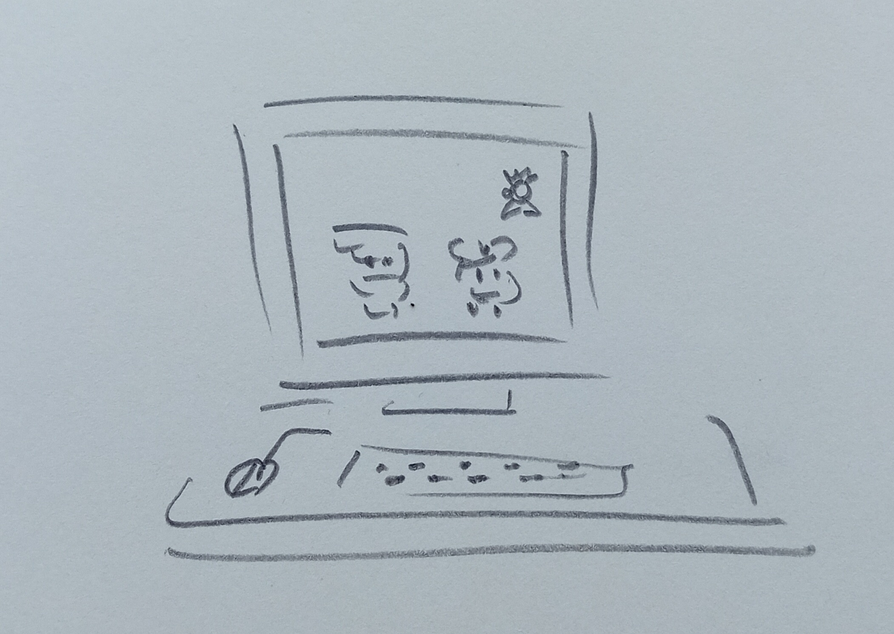
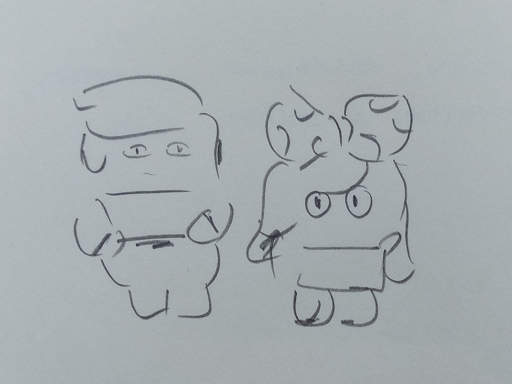
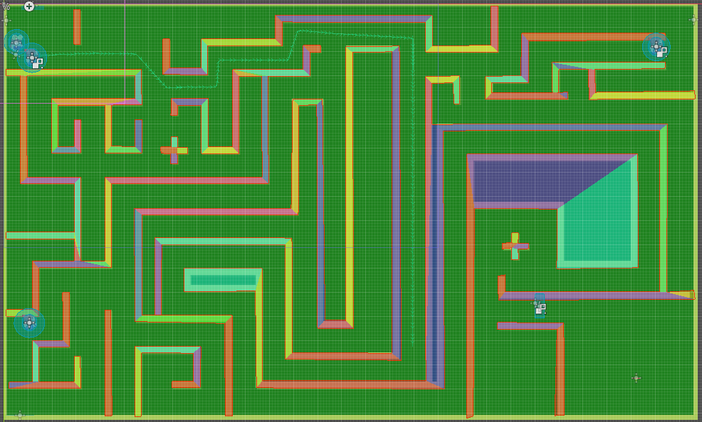
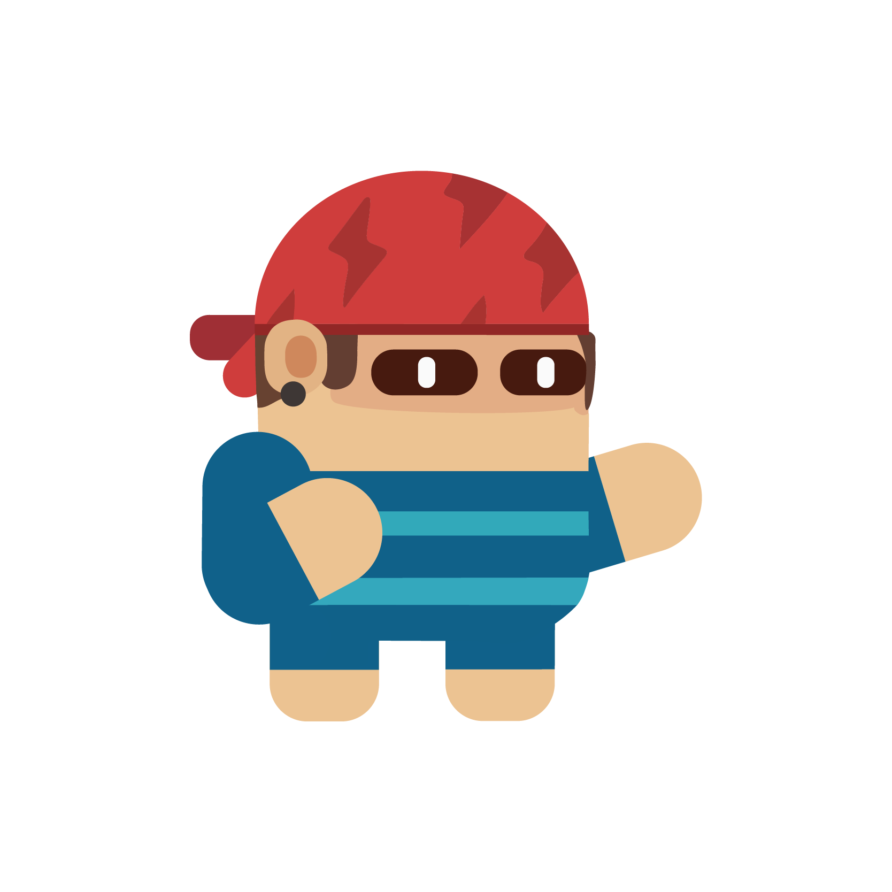
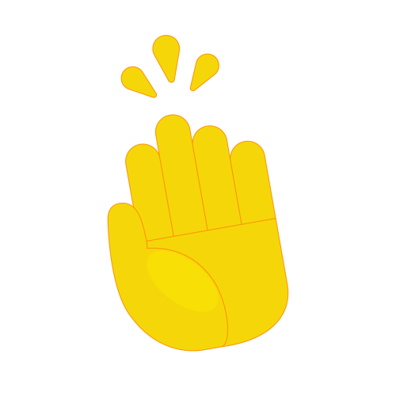
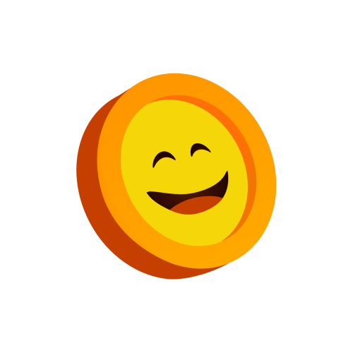
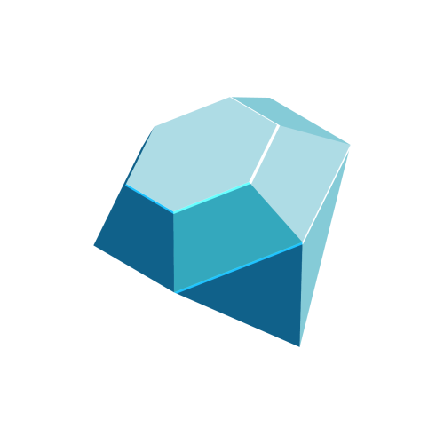

# Documentation

Wanna know more about the development of our game?  
You've come to the right place!

From conceptual work to graphical asset iterations to technical development, you'll find all the details here!

## The Concept

During the first phase of the hackathon, the team was focused on nailing down the overall concept! During this process, we identified the _Problem_, our _target audience_, what's the _message_ we're trying to convey, and the creative _insight_ we're using to spread our message.  

You can find our final pitch, condensing all these elements in the presentation below:

<object data="/pitch.pdf" type="application/pdf" width="90%" height="500px">

Unable to display the PDF file. You can try and<a href="/pitch.pdf">download it instead</a> instead.
</object>

## Game Development

With these building blocks laid out in the initial phase of the hackathon, the team could delve deeper into developing a prototype of the game to further show its potential!

## The Constraints

Due to the hackathon setting and all the time constraints associated with it, the following technical choices were made from the start:

+ The game will be developed to be played in a web browser without requiring the instalation of any software;
+ The game will only be optimized for desktop browsers;
+ The [Godot Engine](https://godotengine.org/) will be used for development;
+ The game will be single-player only;
+ The game will be limited to "three characters" and "three levels" (whatever that ends up meaning);
+ The game will tackle three principles of netiquete: **be kind**, **keep personal information private**, and **respect others’s wishes**.

These base definitions allowed the team to start a _mini_-brainstorm for game mechanics and features from the get got restrained by the technical development, as this is the more time-consuming element.

### Game Mechanics & Concept Expantion

When thinking about the game and how to engage children from 8 to 10, the motto of "make it fun" kept bouncing around in our minds. The game will have to bring kids in from the get-go if we want to capture their attention and really get our message across.  

{ width="500" }

In that sense, we started to think about emulating the online gaming environment. After all, netiquete is our core concept. Our setup is:  

!!! tip "É Bué Fixe Ser Fixe Online"
    **Our player is gaming with his two (maybe best) friends. We are facing different challenges, and the way that our player interacts with his friends in these challenges can help or hinder his progress in the different levels**  

This way we have not only the challenges of the levels themselves but also the interactions with other players to bring out the netiquette principles.  

{ width="500" }

Dissecting our setup above, we get:

+ **"Our player is gaming with his two (maybe best) friends"**: we need to portray these three players (we included) and that we are all playing these online game.
+ **"We are facing different challenges"**: the core gameplay will be a set of 3 mini-games with different mechanics. The player can tackle these in any order and will earn badges when completing each. The mini-games will be developed around the netiquette core concepts;
+ **"the way that our player interacts with his friends in these challenges [has effects on the player outcomes]"**: on top of the overall goal of the mini-game, the different interactions the player has will alter the way the game plays out.

From this definition, we started developing the concepts for our 3 mini-games.  
After some brainstorming, we came up with:

1. "O Labirinto" (The Labyrinth): where the player has to cross a somewhat complex labyrinth while also finding friends allong the way;
2. "A Ponte Emoji (The Emoji Bridge"): a platforming challenge where the player has to collect all the emojis with some hidden mechanics to be found...
3. "O Salto Conjunto" (Group Jump): where the player has to help one of the friends in accomplishing a scary jump!

<figure markdown>
  { width="600" }
  <figcaption>Development Version: "O Labirinto" (The Labyrinth)</figcaption>
</figure>

<figure markdown>
  { width="600" }
  <figcaption>Development Version: "A Ponte Emoji (The Emoji Bridge")</figcaption>
</figure>

<figure markdown>
  { width="600" }
  <figcaption>Development Version: "O Salto Conjunto" (Group Jump)</figcaption>
</figure>

### Game Assets

Meet our characters!

{ width="300" }
{ width="300" }
{ width="300" }

The badges the player is able to collect!

{ width="300" }
{ width="300" }
{ width="300" }

And the final banner!

