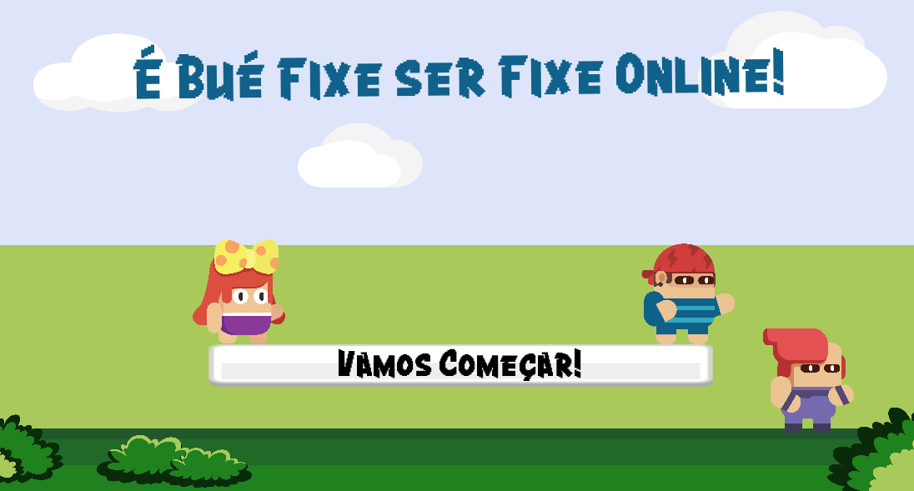

# É Bué Fixe Ser Fixe Online

**É Bué Fixe Ser Fixe Online**,  
_roughly_ translated to "It's Super Cool to Be Cool Online",  
it's an educational game targeting Portuguese children between the ages of 8 and 10.

Netiquette is an important topic, and our goal is to show kids how _being cool online_ can be cool!

It came together as a result of the [Hackathon in Digital Communication and Literacy](https://www.hackathonpractices.com/) promoted EUGLOH and U.Porto.

Whether you want to learn more about the project or just play the game, you've come to the right place!

## Vamos Começar! (_Let's Get Started!_)

[:fontawesome-solid-play: Play the Game](jogo/){ .md-button .md-button--secondary }
[:fontawesome-solid-box: Documentation](documentation){ .md-button .md-button--primary }

(Please note that _currently_ the game is only in Portuguese and only optimized for playing on a desktop browser)

{ width="200" }
{ width="200" }
{ width="200" }

## Meet the Team

+ Catarina Marques - Psychologist
+ Henrique Diogo Silva - System's Designer
+ Luís Trigo - Digital Humanist
+ Miguel Correia - Educologist
+ Carolina Quirino - UI&UX Designer
